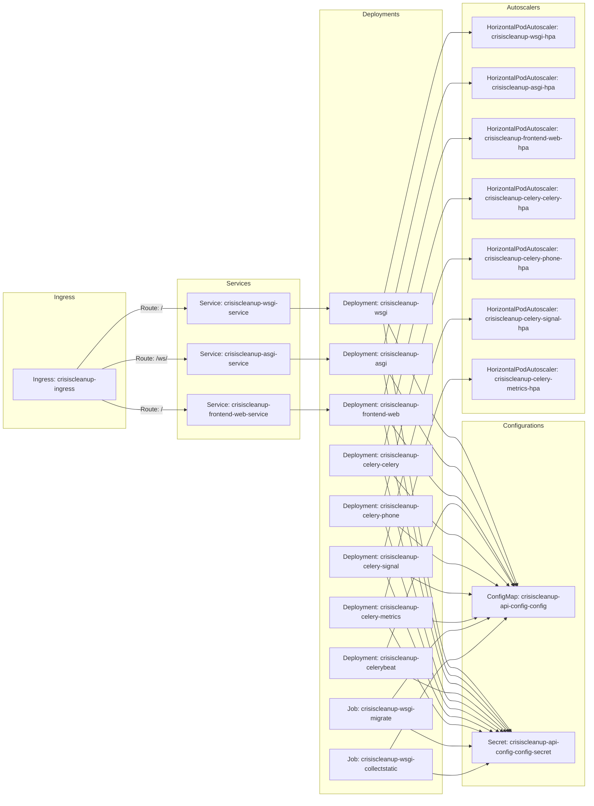

# CrisisCleanup Infrastructure

Projen powered IaC for CrisisCleanup.

## Charts

### CrisisCleanup

```mermaid
graph LR
    subgraph Ingress
        A[Ingress: crisiscleanup-ingress]
    end
    subgraph Services
        B[Service: crisiscleanup-wsgi-service]
        C[Service: crisiscleanup-asgi-service]
        D[Service: crisiscleanup-frontend-web-service]
    end
    subgraph Deployments
        E[Deployment: crisiscleanup-wsgi]
        F[Deployment: crisiscleanup-asgi]
        G[Deployment: crisiscleanup-frontend-web]
        M[Deployment: crisiscleanup-celerybeat]
        N[Deployment: crisiscleanup-celery-celery]
        P[Deployment: crisiscleanup-celery-phone]
        R[Deployment: crisiscleanup-celery-signal]
        T[Deployment: crisiscleanup-celery-metrics]
        V[Job: crisiscleanup-wsgi-migrate]
        W[Job: crisiscleanup-wsgi-collectstatic]
    end
    subgraph Configurations
        K[ConfigMap: crisiscleanup-api-config-config]
        L[Secret: crisiscleanup-api-config-config-secret]
    end
    subgraph Autoscalers
        H[HorizontalPodAutoscaler: crisiscleanup-wsgi-hpa]
        I[HorizontalPodAutoscaler: crisiscleanup-asgi-hpa]
        J[HorizontalPodAutoscaler: crisiscleanup-frontend-web-hpa]
        O[HorizontalPodAutoscaler: crisiscleanup-celery-celery-hpa]
        Q[HorizontalPodAutoscaler: crisiscleanup-celery-phone-hpa]
        S[HorizontalPodAutoscaler: crisiscleanup-celery-signal-hpa]
        U[HorizontalPodAutoscaler: crisiscleanup-celery-metrics-hpa]
    end
    A -->|Route: /| B
    A -->|Route: /ws/| C
    A -->|Route: /| D
    B --> E
    C --> F
    D --> G
    E --> H
    F --> I
    G --> J
    E --> K
    E --> L
    F --> K
    F --> L
    G --> K
    G --> L
    M --> K
    M --> L
    N --> K
    N --> L
    N --> O
    P --> K
    P --> L
    P --> Q
    R --> K
    R --> L
    R --> S
    T --> K
    T --> L
    T --> U
    V --> K
    V --> L
    W --> K
    W --> L
```
